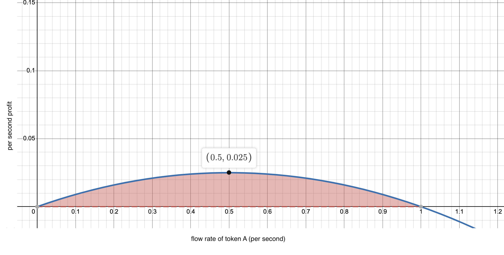

# 💵 Arbitrage

In order to facilitate efficient price discovery, Aqueduct will rely on arbitrageurs to exploit price discrepancies across Aqueduct’s pools and other money markets. Traditionally, arbitrageurs on AMMs benefit from the atomic nature of transactions to execute a trade, and take profit in the same transaction, leading to riskless arbitrage (not counting the competition from frontrunners). As Aqueduct swaps occur over time as prices move, the price you get for an asset will change depending on the ratio of incoming pool assets. This means arbitragers take on additional risk when compared to a discrete AMM. One key difference is that arbitragers will have to ensure that the stream they are executing to extract profit remains profitable.

## Arbitrage example

Consider an example with two assets, asset A and asset B, with a fair market value of 1 A = 1 B. Given flow-rates of RA = 9 and RB = 10 each second into the pool, an arbitrage opportunity would be created. In order to bring the prices on Aqeudct back into alignment with fair market value, an arbitrageur can start a stream of asset A for asset B in order to extract profit. The diagram below represents the possible profit the arbitrageur can extract. 0 on the x-axis is what would happen if the arbitrageur did not start a stream to extract profit, 1 on the x-axis represents the arbitrageur streaming in the required amount (1 of token A per second) to bring the prices back in line with the wider market. The area underneath the blue line and above 0 on the y-axis (Shaded red) represents the profit an arbitrager can extract.

<figure><figcaption></figcaption></figure>

The optimal trade for an arbitrageur brings Aqueduct's price 50% closer to the fair market price. This is a result of the tradeoff between the trader’s received flowrate and the remaining price discrepancy after they execute their trade. They must ensure that their trade executes while the arbitrage opportunity exists.  If the prices deviate from the profit-making range, the arbitrageur will start making a loss compared to the wider market prices. Therefore, while the opportunity for profit exists on Aqueduct, the risk for the arbitrageur is higher.

Arbitraging on Aqueduct could lead to some exotic forms of MEV, this is an area that the Aqueduct team is excited to explore further.
