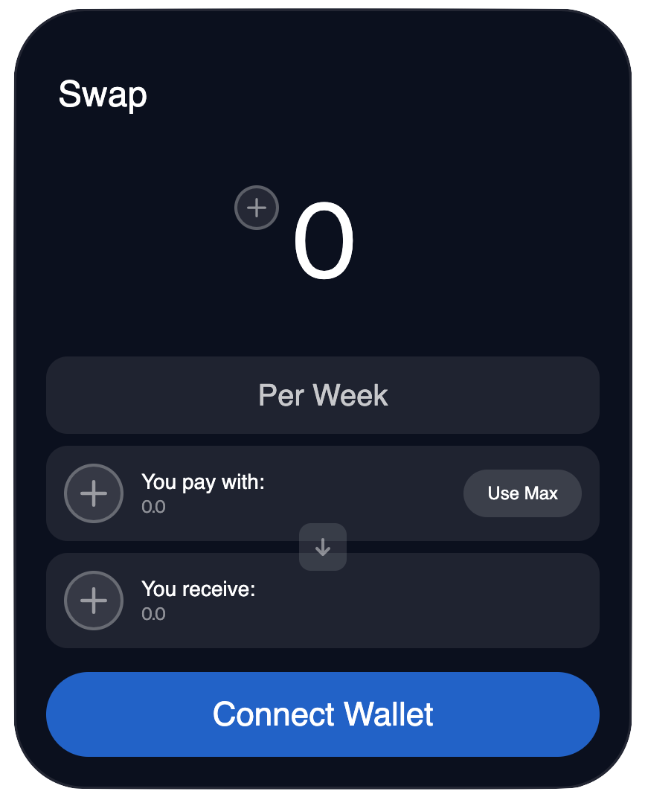

# 🏛 TWAMM Swap Widget

This guide is a walk through of the steps needed to embed the Aqueduct TWAMM widget into your web based application. This widget enables your users to swap any token over time on Aqueduct without leaving your website.

Here is a preview of the default swap widget.\


<figure><figcaption><p>Default swap widget</p></figcaption></figure>

Some example use cases:

* Enable users to DCA into your token with a few clicks, directly from your website.
* Provide an alternative to OTC traded large orders with time-based swaps.
* Allow organizational users to provide a quick interface for divestment/portfolio diversification.

The swap widget provides complete customizability to make it fit perfectly within your app.

## Install the Widget

In order to get started, you'll need to install with swap widget component using npm or yarn. If you don't already have wagmi and viem installed to your application, you'll need to install those as well.

```
npm install --save aqueduct-widget wagmi viem
```

## Implementing the Widget into Your App

You'll first need to set up Wagmi config within your app.js file, like this:

```typescript
import { WagmiConfig, createConfig } from 'wagmi'
import { createPublicClient, http } from 'viem'
import { polygon } from "wagmi/chains";
 
const config = createConfig({
  autoConnect: true,
  publicClient: createPublicClient({
    chain: polygon,
    transport: http()
  }),
})
 
function App() {
  return (
    <WagmiConfig config={config}>
      <Profile />
    </WagmiConfig>
  )
}
```

Import the swap widget and embed the component into your application.

```typescript
import type { NextPage } from "next";
import TWAMMWidget from "aqueduct-widget";

const Home: NextPage = () => {
  return (
      <div>
        <TWAMMWidget />
      </div>
  );
};

export default Home;
```

Done! You should now be able to see the default Aqueduct swap widget on your app. Let's dive into the customization of the swap widget.

## Customizing the Swap Widget

You can set optional parameters to make the appearance of the swap widget fit perfectly into the design of your app.&#x20;

You can customize the border radius, colors, and fonts of the widget to match the design of your app. We also have a few pre-defined themes you can use as defaults, such as light and dark mode.&#x20;

<figure><figcaption><p>Basics of the swap widget </p></figcaption></figure>

All of the attributes shown above are hex codes (e.g. #FFFFFF), except 'textFont.' Fonts should be formatted as such:

```json
  textFont: "'Neue Haas Grotesk Display Pro Roman', sans-serif",
```

Colors should be formatted as such:

```typescript
  bgColor: "#00000050",
```

To edit the theme in your app, you can pass optional parameters into the TWAMMWidget component, here's a quick example:

```typescript
import type { NextPage } from "next";
import TWAMMWidget, { darkTheme } from "aqueduct-widget";
import "aqueduct-widget/styles";
import { Theme } from "aqueduct-widget/dist/theme";

const Home: NextPage = () => {

  const theme: Theme = {
    ...darkTheme,
    bgColor: "#00000050",
    textFont: "'Neue Haas Grotesk Display Pro Roman', sans-serif",
    numberFont: "'Neue Haas Grotesk Display Pro', sans-serif",
  };

  return (
      <div>
        <TWAMMWidget theme={theme} />
      </div>
  );
};

export default Home;
```

Here, we have a few additional imports that were not present before. To start, we have imported "darkTheme," which is a theme preset that comes default with the widget (this is optional). We have also imported the type 'Theme' from the aqueduct-widget package as well, this defines the types of all of the optional params for type safety.

We've defined three parameters to be passed, including bgColor, textFont, and numberFont. These are all specific styling changes, where as all other styles will be auto filled by default with 'darkTheme.'

Here's a complete list of all of the optional styling parameters you can pass:

| Name                         | Styled Component                                                         |
| ---------------------------- | ------------------------------------------------------------------------ |
| TitleColor                   | "Swap" title                                                             |
| bgColor                      | Background of the widget                                                 |
| primaryBorderRadius          | Border Radius of the container                                           |
| secondaryBorderRadius        | Border Radius of the selector buttons                                    |
| accentBorderRadius           |                                                                          |
| checkBorderRadius            |                                                                          |
| timeSelectBottomBorderRadius | Border radius of the time selector                                       |
| borderColor                  | Border color of all components                                           |
| primaryBorderWidth           | Border width of the container                                            |
| secondaryBorderWidth         | Border width all secondary selectors                                     |
| plusBg                       | Background color of non selected token inputs or outputs                 |
| plusBorder                   | Border color of non selected token inputs or outputs                     |
| plusColor                    | Color of the "+" in non selected token inputs or outputs                 |
| useMaxButton                 | Background color of the use max button                                   |
| useMaxText                   | Font size of the use max button                                          |
| itemBorderRadius             |                                                                          |
| inputDot                     |                                                                          |
| icons                        |                                                                          |
| streamLengthText             | Color of the text on the stream length button                            |
| streamLengthBox              | Background color of the stream length button                             |
| tokenBox                     | Background color of the input/output token boxes                         |
| dataDisplayBg                | Background color of the 'information' display modals                     |
| swapArrowBox                 | Background color of the arrow box in between the input and output tokens |
| swapArrow                    | Color of the arrow in between the input and output boxes                 |
| primaryText                  | Primary font color                                                       |
| secondaryText                | Secondary font color                                                     |
| accentText                   | Accent font color                                                        |
| primaryFontWeight            | Primary font weight                                                      |
| titleFontWeight              | Font weight of the "Swap" title                                          |
| secondaryFontWeight          | Font weight of all secondary fonts                                       |
| accentFontWeight             | Font weight of all accent fonts                                          |
| swapButton                   | Background color of the swap button, including "Connect Wallet"          |
| swapButtonText               | Font color of the text within the swap button                            |
| swapButtonFontSize           | Size of the font in the swap button                                      |
| swapButtonPadding            | Padding within the swap button                                           |
| swapButtonRadius             | Radius of the swap button                                                |
| secondaryMain                |                                                                          |
| approveBox                   | Background color of the buffer approval box                              |
| loaderInner                  |                                                                          |
| loaderOuter                  |                                                                          |
| textFont                     | Font of all text in the swap widget, not including numbers               |
| numberFont                   | Font of all numbers in the swap widget, not including text               |
| primaryDuration              | Primary animation duration for all components                            |
| secondaryDuration            | Secondary animation duration for all components                          |
| accentDuration               | A third animation duration for all components                            |
| errorColor                   | Color of the 'error' code thrown whenever a transaction fails            |
| successColor                 | Color of the 'success' code thrown whenever a transaction is successful  |
| embeddedLink                 |                                                                          |

You can toggle all of these optional parameters to style the swap widget to match your app.&#x20;

## Toggling between dark theme and light theme

The swap widget comes equipped with both light theme and dark theme defaults for your app. You can change specific styling options within each of these themes to fit the style of your choice. Here's an example of how you can enable your users to switch between light and dark theme in your app.

```typescript
import type { NextPage } from "next";
import TWAMMWidget, { darkTheme, lightTheme } from "aqueduct-widget";
import "aqueduct-widget/styles";
import { Theme } from "aqueduct-widget/dist/theme";

const Home: NextPage = () => {

  const darkThemeMyApp: Theme = {
    ...darkTheme,
    bgColor: "#00000050",
    textFont: "'Neue Haas Grotesk Display Pro Roman', sans-serif",
    numberFont: "'Neue Haas Grotesk Display Pro', sans-serif",
  };

  const lightThemeMyApp: Theme = {
    ...lightTheme,
    bgColor: "#00000050",
    textFont: "'Neue Haas Grotesk Display Pro Roman', sans-serif",
    numberFont: "'Neue Haas Grotesk Display Pro', sans-serif",
  };

  let darkMode = true;

  return (
      <div>
        <TWAMMWidget theme={darkMode ? darkThemeMyApp : lightThemeMyApp} />
      </div>
  );
};

export default Home;
```
