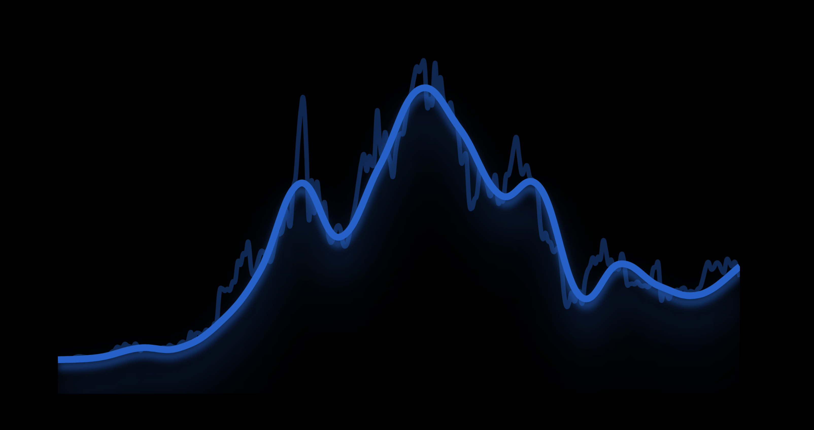

# 🏦 Institutional DCA

Aqueduct's TWAMM offers several benefits for institutional DCA and will become the best place for institutions to buy/sell on-chain over time. Our TWAMM is designed to facilitate the per-second swapping of assets with the addition of supporting large orders. Institutional investors can execute large orders over an extended period while maintaining a consistent average execution price. Similar to the TWAP, except Aqueduct's TWAMM is automated and requires a single order instead of many different sub-orders.

Aqueduct allows institutional investors to avoid large price swings that can occur when executing large orders in a single transaction. By breaking down the order into smaller portions and executing them at regular intervals, the impact on the market is reduced. This helps to mitigate the risk of moving the market price against the investor's desired direction.

The TWAMM on Aqueduct also ensures that institutional investors achieve a time-weighted average price (TWAP) over the duration of their trade. Since swaps take place every second, institutions will be able to buy tokens at every price throughout the life of their trade, creating the perfect TWAP.

<figure><figcaption></figcaption></figure>

As mentioned before, Aqueduct also provides the best known on-chain execution of large orders without the need for centralized financial intermediaries. Institutions can swap large sums of capital through Aqueduct with minimal loss of value through price impact. These trades will also have significantly less impact on the market as a whole since they are being executed over time.

Aqueduct also allows institutional investors to execute their trades with minimal manual intervention. To start a swap on Aqueduct, only one transaction is needed. If you were to manually do a TWAP on-chain without something like Aqueduct, you'd be paying gas for each individual transaction. These gas costs can add up, increasing with every sub-order. With Aqueduct, the gas cost is fixed and is only charged at the beginning of the trade (the start of the transaction).

For investors who are looking to limit the prices in which they trade in a similar way to how a TWAP works in TradFi, we will be implementing stop losses to automatically cancel a trade if an asset hits a certain price.&#x20;
