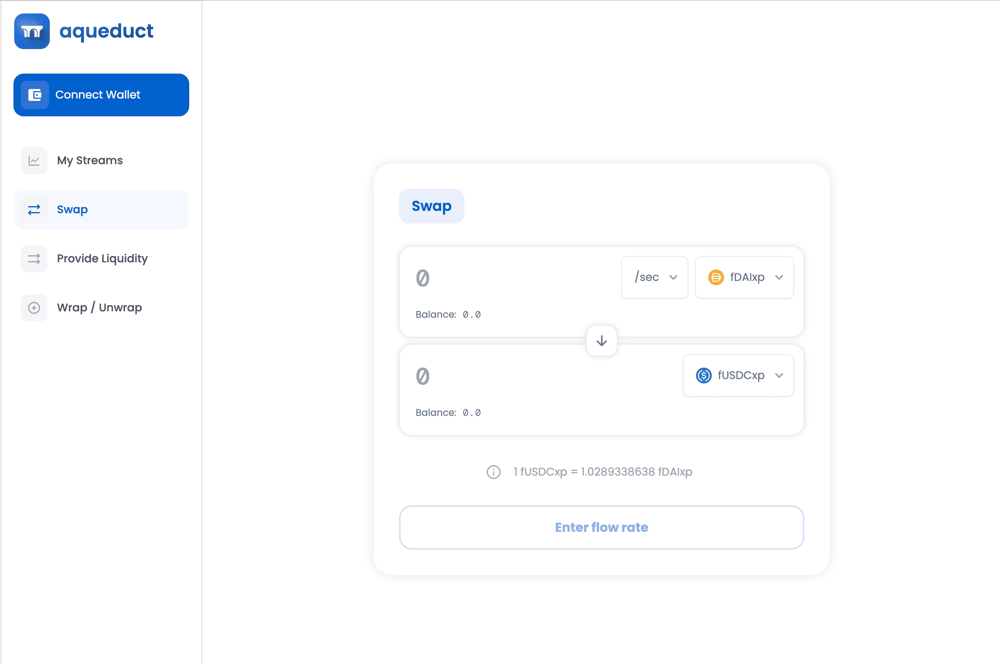

# 🔐 Enforce Lockup

NOTE: All token lockups are created using Hedgey smart contracts. If you have an active token lockup, visit [https://app.hedgey.finance/](https://app.hedgey.finance/).

If you would like to learn more about Hedgey contracts and token lockups, visit [https://hedgey.gitbook.io/hedgey-community-docs/hedgey/investor-lockups](https://hedgey.gitbook.io/hedgey-community-docs/hedgey/investor-lockups).

### Open the app

Navigate to https://app.aqueduct.finance to get started.

<figure><figcaption>
Aqueduct create order page
</figcaption></figure>

### Enter the tokens and amounts

Select the token you want to send and the token you want to receive and the amounts for each.

<figure><figcaption>
Enter the tokens and amounts
</figcaption></figure>

### Click "Enforce lockup"

Click the "Enforce lockup" button located at the top right of the upper token modal.

<figure><figcaption>
Enforce lockup button
</figcaption></figure>

### Choose your unlock frequency

We support three types of unlock frequencies, including linear, periodic, and single. The details of each are shown below.

#### Linear

If you choose linear, the tokens will be allocated to the counterparty over the given lockup period at a linear rate. Just specify the start date, lockup period, and cliff.

<figure><figcaption>
Linear vesting
</figcaption></figure>

#### Periodic

Periodic unlock frequency is the same as linear, except you decide the frequency in which the counterparty receives the tokens over a given lockup period. You can choose between daily, weekly, monthly, or yearly.

<figure><figcaption>
Periodic vesting
</figcaption></figure>

#### Single

Single unlock frequency means the tokens will fully vest at a given date. Simply enter time period you'd like to give for the tokens to fully vest.

<figure><figcaption>
Single vesting
</figcaption></figure>

### Click "Submit Order"

At this point of the swap process, you may be asked to sign token approvals for the tokens you're trading. This simply gives us the ability to send your tokens to your counterparty when they execute the trade.

You may also have to sign token approvals for the Hedgey lockup contract.

If you have already approved tokens, you should see a sign trade modal. Simply click the "Sign message in wallet" button to create your trade.

<figure><figcaption>
Signing transaction view
</figcaption></figure>

### Sign the transaction

Your wallet should prompt you to sign the transaction. Simply click "sign."

<figure><figcaption>
Wallet view
</figcaption></figure>

### Copy the link

Once the you sign the transaction, you should see a confirmation message that says "Trade Signed." Click View / edit order to view order details and copy the link to your trade.

<figure><figcaption>
Signature confirmation
</figcaption></figure>

<figure><figcaption>
Trade view / copy link
</figcaption></figure>

### Share the link with your counterparty

Once your link has been copied, share it with your counterparties. This trade is not restricted, so any counterparty will be able to fill it.

### Counterparty view

Once your counterparty opens the link, they should see a page that looks like the one below.

<figure><figcaption>
Fill view
</figcaption></figure>

### Accepting the vesting schedule

Once the counterparty clicks "Buy fWBTC" in this example, they will be prompted to accept the vesting schedule. Once accepted and the trade is signed, they will be able to view their token lockup in the Hedgey dashboard.
