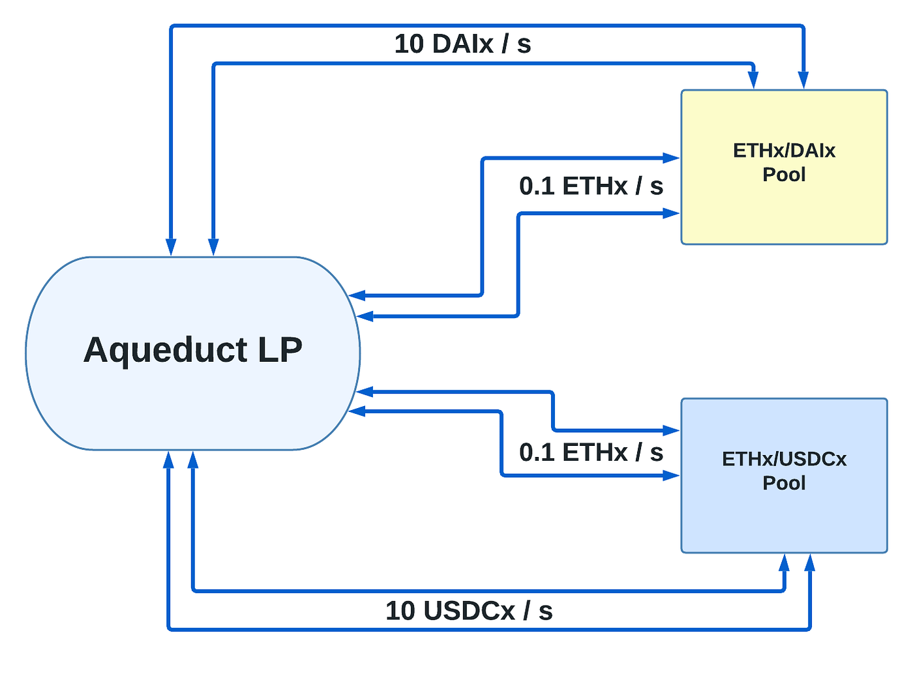

# 🔄 Superfluid Liquidity

Superfluid Liquidity is a form of liquidity enabled by money streams that does not stop moving. Similar to how a real superfluid has zero viscosity and continues to flow without any loss of kinetic energy — Superfluid liquidity never stops. It is this characteristic that powers the 0 TVL architecture of Aqueduct. All liquidity that flows into the pool has to flow out, unlocking new possibilities for liquidity provision.

One important characteristic of Superfluid liquidity is that it allows LPs to provide the same liquidity tokens to multiple pools simultaneously. This is a more capital-efficient approach compared to splitting tokens equally. A smaller number of LPs could serve a larger volume of liquidity on Aqueduct, compared to the same number for a traditional DEX that requires users to deposit tokens into one pool at a time. In theory, given enough volume from traders swapping with the pool, the need for liquidity providers may diminish completely. **This would allow trading fees to approach 0.0%.**

## Example

Say you you have 10 ETH, 10,000 DAI and 10,000 USDC, and want to provide liquidity for an ETH/DAI pool and an ETH/USDC pool on a traditional AMM without one-sided liquidity. You’ll need to split your 10 ETH between two positions equally. So you may end up with a split of 5 ETH and 5000 DAI in the ETH/DAI pool, and 5 ETH and 5000 USDC in the ETH/USDC pool.&#x20;

By providing liquidity to the same pools in Aqueduct, you’d be able to re-use the ETH liquidity to make your 10 ETH go even further than it would in the above example. Through Superfluid liquidity, the same 10 ETH could be used for both the ETH/DAI and ETH/USDC pool at the same time. Thus, maximising yield for LPs and creating more efficient pools

<figure><figcaption></figcaption></figure>
